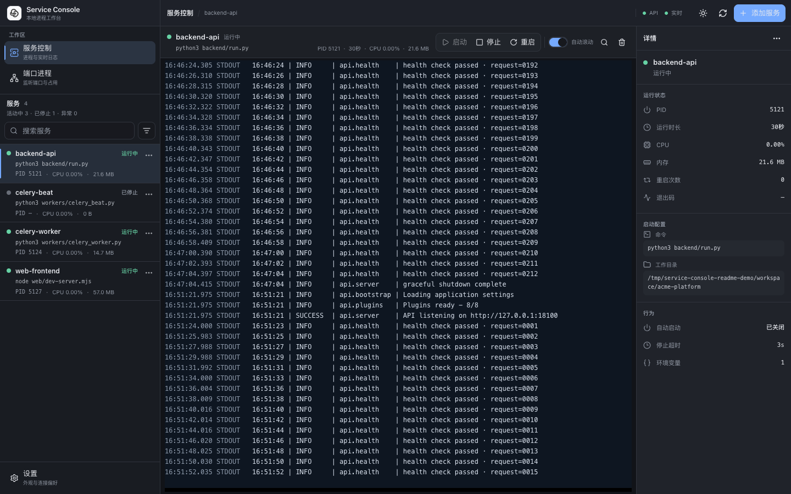
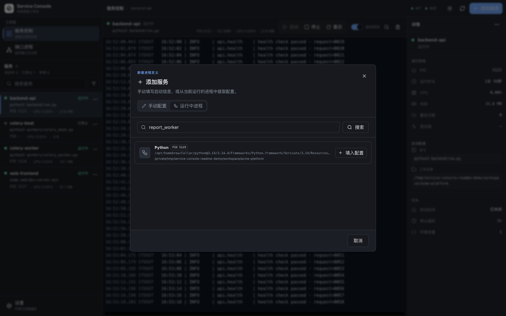
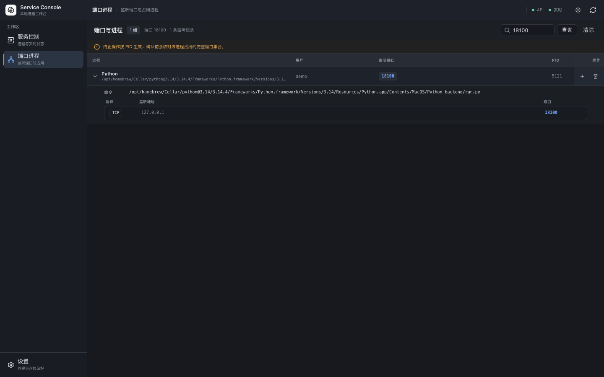
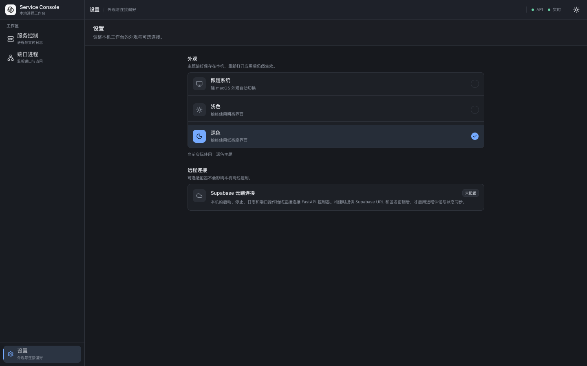

<p align="center">
  
</p>

<h1 align="center">Service Console</h1>

<p align="center">无需容器，直接启动和管理本地开发服务。</p>

<p align="center">桌面端 · Web · CLI · TUI · MCP · 独立日志 · 端口检查 · 远程控制</p>

<p align="center"><a href="README.md">English</a></p>

Service Console 是面向开发工作流的原生进程管理器。服务命令注册一次后，即可从桌面应用、浏览器、
命令行或终端界面执行启动、停止、重启、状态监控和独立日志查看。所有命令都直接作为宿主机进程运行，
不依赖 Docker 或其他容器运行时。

<p align="center">
  
</p>

<p align="center">
  <sub>服务列表、xterm.js 实时日志、生命周期控制与运行指标集中在同一个紧凑工作区。</sub>
</p>

## 主要功能

- 配置命令、工作目录、环境变量、自动启动和优雅停止超时。
- 左侧菜单栏可在“图标 + 名称”和“仅图标”两种模式间切换，服务 item 与服务专属操作保留在内容区。
- 在服务列表、实时终端和运行详情组成的紧凑工作区中启动、停止、重启、编辑、复制、删除或检查服务。
- 查看 PID、运行时间、退出码、重启次数、CPU 和内存。
- 分服务持久化 stdout/stderr，并通过 WebSocket 实时推送。
- 使用 xterm.js 显示 ANSI 日志，支持搜索、复制、链接、换行和滚动历史。
- 查看监听端口及占用进程，并通过 PID/端口二次校验安全终止进程。
- 配置多个 Jenkins 控制器，通过实例 item 切换，浏览 Folder/Job、构建、队列和日志，并在桌面端直接
  触发构建、停止运行或取消排队。
- 自动发现桌面端新版本，验证 Ed25519 签名清单与安装包 SHA-256，并在用户确认后安装重启。
- 搜索当前用户的运行中进程（包括无端口 Worker），自动提取 `uv`/`pnpm` 启动命令和工作目录；
  Windows 无权读取完整元数据时可安全降级为手动补全。
- 使用 Next.js、React、TypeScript、Tailwind CSS、shadcn/ui、Radix UI 与 Lucide React
  构建紧凑控制台，并支持可持久化的浅色/深色主题。
- 桌面端使用随机回环端口、临时 Token 和权限为 `0600` 的运行描述文件。
- 内置 stdio MCP Bridge，让 Codex/AI 配置、启动、停止、重启服务并检查状态与日志。

## 功能导览

以下截图全部使用隔离、脱敏的临时演示进程，不包含个人服务配置、凭据或真实项目日志。

### 从运行中进程创建服务

<p align="center">
  
</p>

可按进程名称、命令或 PID 搜索，再将识别出的启动命令与工作目录填入可编辑的服务定义。该操作不会
挂接现有 stdout/stderr；保存后的命令下一次由 Service Console 启动时才开始采集受管日志。

### 查看端口和占用进程

<p align="center">
  
</p>

可按端口筛选、展开按进程聚合的 TCP/UDP 监听记录、将占用进程添加为服务，或在 PID 与预期端口
二次校验后终止进程。

### 管理多个 Jenkins 实例

在主侧栏打开 **Jenkins**，可以添加一个或多个控制器。每个实例显示为独立 item，包含显示名称、主机、
启用状态和本次连接结果；选中 item 后，Folder/Job 列表、构建历史、队列、详情与控制台日志会一起切换
到该实例，并在本机恢复最近一次选择。窗口较窄时，同一工作区会切换为单面板 tab，避免同时渲染多个
重内容区域。

Jenkins 工作区支持 Job 搜索、Folder 导航、普通或参数化构建、构建状态与历史、停止构建、取消排队，
以及 progressiveText 增量日志。这些记录由本地 Service Console 控制器按需查询 Jenkins，不会额外复制
一套本地 Jenkins 数据库。切换 UI item 不会改变已经发起的 MCP 操作，因为每个 Jenkins API 与 MCP
调用都会显式携带实例 ID。

构建链接始终通过当前实例配置的 Web 地址打开，即使 Jenkins API 返回了内部主机或默认端口。控制台支持
Cmd/Ctrl+F 搜索及上一项/下一项导航，可使用原生选择复制、复制选中按钮和一键复制全部纯文本；日志持续
追加时会保留当前搜索与选择状态。

普通参数化构建中，密码参数留空时不会随 `buildWithParameters` 提交，而是交由 Jenkins 使用已配置的
默认值。真正的 Jenkins 文件上传参数仍暂不支持，并会禁用本地触发。File System List 插件并不是上传
文件，而是选择 Jenkins 服务器上的构建产物，因此其单选模式现已支持。该插件会把部分文件系统错误渲染
成没有机器可读错误标识的本地化单个选项；因此，只有一个选项且 Jenkins 未显式选中/配置默认值时会被
视为歧义状态并禁用本地触发，可在 Jenkins 设置有效默认值或直接在 Jenkins 页面运行。

参数发现同时兼容 Jenkins 核心的 `property` 导出和兼容的 `actions` 导出。静态选项与 Git Parameter
的 `allValueItems` 直接来自 Remote API。Active Choices 与 File System List 的选项没有一致的 JSON
导出，因此本地控制器只在打开“运行”时读取受大小限制的 Jenkins 构建表单，提取服务端渲染的下拉项，
并在真正排队前再次刷新和校验。Hidden 参数不会返回给 UI，而是强制使用同一次 Jenkins 表单提供的值；
Separator 只用于展示。包含这类表单插件的 Job 会使用 Jenkins classic structured `/build` 兼容旧插件，
普通 Job 仍使用 `buildWithParameters`。

Radio 控件、多选、级联/响应式 Active Choices 与真正的上传参数会明确提示并禁用；在支持依赖感知的
动态刷新前，响应式选项仍需在 Jenkins 页面运行。若表单插件 Job 同时包含密码参数，则必须输入密码，因为 classic
表单不能安全恢复一个不可读取的秘密默认值。动态选项发现读取的是当前账号可访问的 Job 构建表单；真正
发送排队 POST 时 Jenkins 才校验 `Job/Build`，所以“能看到候选项”不代表“具有构建权限”。Jenkins、Git
Parameter、Active Choices 与 File System List 插件都应保持安全修复版本。候选数据畸形、截断、过期或
页面结构不兼容时，Service Console 会阻止提交，而不会退化成允许任意文本输入。

### 保存外观偏好

<p align="center">
  
</p>

支持跟随系统、浅色和深色主题，选择结果会持久化。同一页面会显示当前版本、检查签名更新并引导下载
和重启。Supabase 云端连接保持可选，并不影响本地 FastAPI 控制器提供的启动、停止、日志与端口功能。

### 外观与主题

控制台是静态导出的 Next.js 应用。通用组件遵循 shadcn/ui 结构，交互基础使用 Radix UI，无障碍样式
和主题 token 由 Tailwind CSS 管理，图标使用 Lucide React。可通过顶栏太阳/月亮按钮即时切换浅色和
深色主题。首次打开会跟随操作系统配色，手动选择后会保存到控制器数据目录中的
`ui-preferences.json`，因此桌面端重启或随机回环端口变化后仍能保留；日志终端和页面主题色元数据会
同步更新。

桌面端左侧区域采用参考 JetBrains IDE 的固定图标工具栏，不再提供展开/收起状态；鼠标悬停或使用键盘
聚焦图标时会显示对应功能名称。服务卡片、筛选和“添加”入口均位于“服务控制”内容区，与 Jenkins
工作区统一采用内容自管理布局。移动端仍使用带名称的底部导航，服务选择器和添加入口位于服务页自己
的工具栏中。

Supabase 是可选云端适配器。构建时提供 `NEXT_PUBLIC_SUPABASE_URL` 和
`NEXT_PUBLIC_SUPABASE_ANON_KEY` 后，可供后续远程认证或状态同步使用。本地启动、停止、重启、日志和
端口操作始终由 FastAPI 控制器执行，不配置 Supabase 也可完整离线使用。

## 环境要求

| 用途 | 要求 |
|---|---|
| 控制器、CLI、TUI | Python 3.12+ 和 [uv](https://docs.astral.sh/uv/) |
| Web 资源开发 | Node.js 22+ 和 pnpm 11 |
| 原生桌面窗口 | macOS、Windows，或 pywebview 支持的 Linux 环境 |
| 构建 macOS `.app` | macOS、Xcode Command Line Tools、Node.js、pnpm 和 uv |
| 构建 Windows `.exe` | Windows、PowerShell 7、Node.js、pnpm 和 uv |

## 快速开始

```bash
git clone https://github.com/yzbf-lin/service-console.git
cd service-console
uv sync --all-groups
uv run service-console-desktop
```

桌面应用会在随机本机端口启动 FastAPI 控制器，并在原生 pywebview 窗口中打开界面。服务定义和日志
默认保存在 `~/.service-console`。

正式打包的 macOS 应用从 Finder 打开时，Service Console 会在桌面端启动阶段捕获一次用户的交互式
登录 Shell 环境，使受管服务能使用与终端一致的导出 `PATH`，直接解析 Homebrew、`uv`、pnpm、pyenv
等用户工具。环境覆盖顺序为“桌面进程 < 登录 Shell < 服务配置中的 `env`”。源码和 CLI 启动方式继续
沿用当前进程环境，不会额外启动 Shell。若 Shell 初始化失败或超过 8 秒，会安全降级到桌面进程环境；
特殊 profile 的排障场景仍可在服务配置中显式填写 `PATH`。

注册并控制一个原生服务：

```bash
uv run service-console add api \
  --command "uv run backend/run.py" \
  --cwd /path/to/project

uv run service-console start api
uv run service-console restart api
uv run service-console logs api --tail 200 --follow
```

桌面端运行时，CLI 会自动发现随机端口和临时 Token，无需手工复制连接参数。

### 从运行中进程添加服务

打开“服务控制”，点击服务列表右上角的“添加”，再切换到“运行中进程”，即可按名称、命令或 PID
搜索；也可以在“端口与进程”页面点击进程行右侧的加号。选择“填入配置”后，界面会自动填写服务名称、
启动命令、工作目录和安全白名单内的环境变量，保存前仍可修改。

该操作只根据进程生成配置，不会重新挂接现有进程的 stdout/stderr。保存后应先停止原进程，再由
Service Console 启动服务，避免重复实例或端口冲突；日志从首次受管启动开始采集。命令中的 Token、
Password、Secret、API Key 等敏感参数会被遮罩，需手工确认后再保存。

#### Windows 进程权限与手动补全

Windows 可能把同一账户表示为 `DOMAIN\User` 或 `User`；Service Console 会规范化这两种形式，避免把
当前用户的进程误判为其他用户。如果 Windows 无法核验进程所有者或启动时间，界面会改为“手动补全”，
仅使用 PID、进程名和已知端口生成安全草稿，并且不会读取或复用该进程的命令行、工作目录与环境变量。
如果只有部分元数据字段不可用，则保留已安全读取的信息并标出缺失项。填写启动命令和工作目录、核对
参数后即可保存服务配置。

通用进程搜索不会列出已确认属于其他账户的进程；控制器自身及已经受管的进程仍不可导入。从“端口与
进程”页面选择权限受限的进程时，也会进入同一个手动补全流程。应用默认按当前用户权限运行，不需要仅为
导入进程而以管理员身份启动；目标若属于其他账户或高完整性管理员进程，Windows 仍可能限制元数据读取。

### 配置 Jenkins 连接

使用 **Jenkins → 添加实例** 配置显示名称、基础 URL、用户名、API Token、可选 CA 证书包、启用状态和
请求超时。每个实例都可独立编辑、复制、删除或测试连接。Token 在界面中只写不回显：Service Console
通过 Python `keyring` 保存到操作系统凭据后端（macOS Keychain / Windows Credential Locker），普通
JSON 配置只保存非敏感实例字段。Linux 仅接受安全的 Secret Service、KWallet 或 libsecret 后端；若没有
可用的安全凭据后端，Token 只保留在当前应用进程内存中，重启后需要重新输入。API 回包最多返回
`token_present`，浏览器与 MCP 工具结果都不会取得 Token，也不会降级写入明文 Token 文件。

添加或编辑实例时，可展开 **如何获取 API Token**。填写 Jenkins 地址后，界面会生成新版
`/me/security` 与旧版 `/me/configure` 两个个人配置快捷入口，并说明如何使用 **Add new Token →
Generate**。若 Security 返回 `404`，应改用 Configure；登录后仍返回 `403` 时，需要管理员确认个人配置
权限。API Token 沿用所属账号的现有权限，不会扩大该账号可访问的 Job 范围。

建议为 Service Console 创建专用 Jenkins 用户或 API Token，并只授予已启用操作所需权限。只读浏览通常
需要 `Overall/Read` 与 `Job/Read`；触发构建还需要 `Job/Build`，停止构建或取消排队需要
`Job/Cancel`。本机仍需能够访问每个 Jenkins 地址；若系统信任库不包含私有 CA，需要为该实例显式提供
CA 证书包。

#### 排查 Jenkins `403` 响应

使用用户名和密码认证时，Service Console 会在每次写操作前自动获取 Jenkins CSRF crumb，并在实际
请求中复用同一会话 Cookie。API Token 认证通常不需要 crumb，也更适合自动化场景，建议优先使用。

`403` 仍可能有多种原因。若连接测试和只读请求也失败，应检查用户名与凭据；若浏览正常但构建、停止或
队列操作失败，应检查 `Job/Build` 或 `Job/Cancel` 权限；若 Jenkins 明确报告 crumb 缺失或无效，应检查
控制器的 CSRF 配置以及反向代理是否正确保留会话 Cookie。Service Console 不会跨不同会话复用 crumb。

Jenkins 地址应优先使用 HTTPS。为兼容旧版或隔离内网控制器，应用仍支持 HTTP，但 Basic Auth 会在缺少
传输加密时明文发送用户名和 API Token，因此只应在受信任网络中使用。

## 常用命令

| 操作 | 命令 |
|---|---|
| 查看状态 | `service-console list` |
| 启动服务 | `service-console start SERVICE` |
| 停止服务 | `service-console stop SERVICE` |
| 重启服务 | `service-console restart SERVICE` |
| 查看或跟随日志 | `service-console logs SERVICE --tail 200 --follow` |
| 打开终端界面 | `service-console tui` |
| 查看端口 | `service-console ports --port PORT` |
| 正常终止占用进程 | `service-console kill-process PID --port PORT --timeout 3` |
| 超时后强制终止 | `service-console kill-process PID --port PORT --force` |

## 给 AI 使用（MCP）

桌面 Release 包内置独立的 console 型 stdio MCP Bridge。打开 **设置 → AI / MCP 集成**，点击
**安装到 Codex** 即可完成一次性注册，然后按 Codex 的 MCP 加载机制重启 Codex 一次；以后 Service
Console 启动并发布本机控制器后，AI 能力会自动就绪。Codex 按需启动 Bridge，Bridge 从
`~/.service-console/controller.json` 发现随机端口和临时
Token，因此 Codex 配置中不保存凭据，也不需要在每次应用启动后更新端口。

如果 AI 首次调用工具时桌面应用尚未运行，Bridge 会自动拉起同一安装目录中的 Service Console 并等待
控制器就绪。应用更新或重启后，Bridge 会重新读取运行描述文件。设置页的 **测试连接** 会执行真实的
MCP 握手并调用只读的 `service_list` 工具。

也可以手工注册打包后的 Bridge：

```bash
# macOS
codex mcp add service-console -- \
  "/Applications/Service Console.app/Contents/MacOS/Service Console MCP"
```

```powershell
# Windows：请按实际安装目录调整路径
codex mcp add service-console -- `
  "C:\Program Files\Service Console\Service Console MCP.exe"
```

源码开发环境可以使用同一个虚拟环境入口：

```bash
codex mcp add service-console -- \
  "$(pwd)/.venv/bin/python" -m service_console.mcp_server
```

### 项目启动配置

在需要管理的项目根目录创建 `.service-console.json`。相对工作目录会以该文件所在目录为基准解析：

```json
{
  "version": 1,
  "project": "example-project",
  "services": [
    {
      "name": "example-backend",
      "command": "uv run backend/run.py",
      "cwd": ".",
      "env": {"PYTHONUNBUFFERED": "1"},
      "auto_start": true,
      "stop_timeout": 10
    }
  ]
}
```

AI 调用 `project_apply_config` 后会创建、更新或跳过未变化的服务，但不会删除文件中未声明的现有服务。
随后可通过 `service_restart`、`service_status` 和 `service_logs` 完成代码修改后的重启验收。建议在项目的
`AGENTS.md` 中记录：修改后端后重启 backend，修改 Celery 任务后重启 worker，修改定时调度配置时再
额外重启 beat；每次重启后检查状态并读取最近日志。

Bridge 还提供 `service_list/status/upsert/start/stop/restart/logs`、`port_list`、
`process_list/import/terminate`。其中停止、重启和终止进程会改变本机进程状态，AI 客户端可根据 MCP
annotations 显示确认提示。

### Jenkins MCP 工具

AI 应先调用 `jenkins_instance_list`，再把选中的 `instance_id` 显式传给其他每个 Jenkins 工具。UI 当前
选中的 item 不会成为隐式默认值，因此操作人员切换实例时，不会把 AI 正在执行的操作重定向到另一个
Jenkins。

| 用途 | MCP 工具 |
|---|---|
| 浏览实例与 Job | `jenkins_instance_list`、`jenkins_job_list`、`jenkins_job_status` |
| 查看构建与有限日志 | `jenkins_build_list`、`jenkins_build_status`、`jenkins_build_logs` |
| 查看队列 | `jenkins_queue_list` |
| 触发任务 | `jenkins_build_trigger` |
| 停止或取消 | `jenkins_build_stop`、`jenkins_queue_cancel` |

`jenkins_build_logs` 每次只读取一段有限的 progressiveText，输出受 `max_bytes` 限制（默认 64 KiB，
最大 1 MiB）；需要继续读取时，使用返回的 `next_offset` 再显式调用，不会开启无限日志流。触发构建是
非幂等操作，Bridge 在传输失败后不会自动重试；停止构建和取消队列标记为 destructive，其余浏览、状态
与日志工具标记为只读。Jenkins Token 不是 MCP 参数，也不会返回给 AI；本地控制器会根据选中的实例从
系统 keyring 解析凭据。
需要让 AI 查看 Git Parameter、Active Choices 或 File System List 的动态值时，调用
`jenkins_job_status` 并设置 `include_parameter_options=true`，再把返回的某个 `choices` 值传给
`jenkins_build_trigger`。动态发现可能查询 SCM 或 Jenkins 控制器配置的文件系统，因此默认不读取；触发
前还会重新获取并校验，过期、空、File System List 单项歧义、多选、响应式或不可用的候选集都会在发送
POST 前被拒绝。

## 浏览器控制器

Linux、无桌面服务器或偏好浏览器界面时，可以单独启动控制器：

```bash
uv run service-console serve --host 127.0.0.1 --port 8787
```

打开 <http://127.0.0.1:8787>。控制器拥有其子进程组；正常关闭最后一个桌面窗口或停止控制器会优雅
停止受管服务。系统强制退出或直接杀死控制器可能留下子进程，重新启动前应先检查端口。

不要让 `service-console serve` 和 `service-console-desktop` 同时使用同一个数据目录。

## 安全模型

桌面控制器只监听回环地址，并将随机 URL、PID、实例 ID 和临时 Token 写入
`~/.service-console/controller.json`。文件权限为 `0600`，正常退出时自动删除，并使用进程锁避免多个
桌面实例互相覆盖。

注册命令属于受信任本地配置，并以控制器相同的系统权限运行。需要远程访问时，必须配置高强度 Token，
并在控制器前终止 TLS。不要把无鉴权控制器暴露到不可信网络。

## 桌面端自动更新

打包后的桌面应用会立即读取当前版本，并在启动约 2.5 秒后检查 GitHub Releases 的最新稳定版本。只有
当 `latest-update.json` 能通过应用内置公钥的 Ed25519 验签时，版本信息和下载地址才会被信任；下载的
平台安装包还必须与签名清单中的文件名、字节数和 SHA-256 完全一致。

打开“设置 → 应用更新”可以手动检查、下载更新，并选择“安装并重启”。安装不会静默执行：确认窗口会
明确提示关闭 Service Console 将优雅停止全部受管服务；新版本重新打开后，启用了 `auto_start` 的服务
会再次启动。

自动替换仅用于正式打包的 macOS arm64 与 Windows x64 Release，且安装目录必须可写。源码运行、纯
浏览器控制器或不支持的架构仍能发现版本，但会引导前往 Release 下载页。首个内置更新公钥的版本需要
手动安装，从它之后发布的版本才能在应用内更新。

Windows Release 会内置原生 `Service Console Updater.exe`。桌面端关闭前，程序先把更新器复制到安装
目录之外，并等待它写入启动确认；更新器随后等待原桌面进程准确退出、替换应用目录、启动新版本，并在
新窗口报告 ready 前保留旧版本备份。新版本启动失败时会恢复并重新打开旧版本。诊断日志位于
`%USERPROFILE%\.service-console\updates\vVERSION\install-update.log`。

Windows 0.2.0 和 0.2.1 使用旧更新启动器。如果这两个版本点击“安装并重启”后只关闭应用，请手动下载
并解压安装一次 0.2.2 或更高版本；完成这次迁移后，后续应用内更新会使用上述原生更新器和回滚流程。

## 打包 macOS 应用

需要 macOS、Xcode Command Line Tools、Node.js、pnpm 和 uv：

```bash
./scripts/build-macos-app.sh
open "dist/Service Console.app"
```

脚本会从 `assets/service-console-icon-1024.png` 生成多分辨率 ICNS 图标；用户提供的透明产品标志原图
保留在 `assets/service-console-logo.png`。随后静态导出 Next.js 与 xterm.js 界面，再用 PyInstaller 打包
CPython、pywebview、FastAPI、完整界面和 console 型 MCP sidecar。Bundle 版本自动与
`pyproject.toml` 同步并进行 ad-hoc 签名。

产物匹配构建机器架构，目前已在 Apple Silicon 上验证。它尚未使用 Apple Developer ID 签名和公证，
通过 GitHub 下载后可能触发 Gatekeeper 提示。`dist/` 默认不进入 Git，应通过 GitHub Releases 分发。

更换产品标志时，将透明原图保存为 `assets/service-console-logo.png`，再统一生成桌面图标、README 图标、
顶栏 Logo 和 favicon：

```bash
uv run --group icon python scripts/build_brand_assets.py
./scripts/build-macos-icon.sh
pnpm run build:web-assets
```

## 打包 Windows 应用

在 Windows 上使用 PowerShell 7、Node.js、pnpm 和 uv：

```powershell
pwsh ./scripts/build-windows-app.ps1
& "dist/Service Console/Service Console.exe" --help
```

脚本会生成多分辨率 ICO 图标、构建同一套离线界面，并在 `dist/Service Console` 生成 PyInstaller
目录包、`Service Console MCP.exe` 和单文件原生 `Service Console Updater.exe`。Windows 10/11 需要
安装 Microsoft Edge WebView2 Runtime。
当前 Windows 可执行文件未进行
商业代码签名，在配置可信代码签名证书前可能出现 SmartScreen 提示。

## 发布 Release 包

仓库的 `Release` GitHub Actions 工作流会构建 Apple Silicon macOS ZIP 和 Windows x64 ZIP。推送与
`pyproject.toml` 版本一致的标签后，会将两个安装包、`SHA256SUMS.txt`、`latest-update.json` 和
`latest-update.json.sig` 发布到 GitHub Releases：

```bash
git tag vX.Y.Z
git push origin vX.Y.Z
```

清单签名使用受保护的 `SERVICE_CONSOLE_UPDATE_PRIVATE_KEY_B64` Actions Secret；仓库和客户端只保存
对应公钥。发布过程先写入可恢复的 Draft，再显式标记为 Latest；工作流会拒绝覆盖已经发布的同名
Release。若需要由 GitHub 强制保护标签和资产，还应在仓库设置中启用 Immutable Releases。

也可以手动运行该工作流，只生成可下载的 Actions 构建产物而不创建 GitHub Release。

## FastAPI + Vite + Celery 示例

仓库提供了后端、前端、Celery Worker 和 Celery Beat 的完整原生管理示例，见
[examples/pd-qa-backend.md](examples/pd-qa-backend.md)。Beat 需要显式启动，避免多个调度器重复投递任务。

## 开发与测试

```bash
uv sync --group dev
pnpm install --frozen-lockfile
pnpm run typecheck:web
pnpm run lint:web
pnpm run test:web
pnpm run build:web-assets
uv run pytest
```

接口和架构约束见 [CONTRACT.md](CONTRACT.md)，贡献说明见 [CONTRIBUTING.md](CONTRIBUTING.md)。

## 许可证

[MIT](LICENSE)
